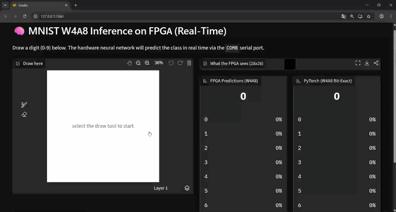

# MNIST W4A8 on Tang Primer 20K FPGA

> **100% Open-Source Toolchain**: This entire workflow relies exclusively on open-source tools. No proprietary code is used, and heavy vendor software like Vivado is not required to synthesize or flash the FPGA.



This repository contains the hardware accelerator and software inference code for a Convolutional Neural Network (CNN) running on an FPGA (Tang Primer 20K). The Verilog hardware description was automatically generated using the [spinalML](https://github.com/Juste-Leo2/spinalML) library. Furthermore, this system is capable of handling true, continuous real-time predictions: as you draw or modify a digit on the interface, the FPGA processes the byte stream and returns the logits for a seamless, live interaction.

**spinalML** is a powerful toolset utilizing Verilator, Cocotb (Python), and formal verification to bridge the gap between machine learning and hardware description.

## Architecture

This CNN classifier targets the MNIST dataset using an aggressive mixed-precision quantization: **W4A8**.
- **Conv2D**: Runs as a true INT4 matrix multiplication (weights stored as I4, activations as I8, I16 accumulator).
- **Linear**: Uses FP8 (E4M3 format) for weights and activations, executed after an explicit `Cast` operation following the ReLU and MaxPool layers.

### Model Performance & Limitations
- **Hardware Utilization**: Based on synthesis reports for the Tang Primer 20K, the hardware footprint is highly efficient. The design consumes approximately **10,020 LUTs** (526 LUT1, 1521 LUT2, 3541 LUT3, 4432 LUT4), 2,600 ALUs, and ~5,880 Registers (DFFs). It comfortably fits within the ~20K LUTs available on the board.
- **Network Size & Accuracy**: This network is intentionally very small to easily fit within the hardware constraints of the Tang Primer 20K. While it achieved approximately 90% accuracy on the validation dataset during training, it is not a highly robust model. As a result, the CNN may occasionally yield false positives or incorrect predictions on ambiguous drawings.
- **Softmax Hardware Constraint**: A true Softmax operation is generally avoided in such hardware implementations because it only efficiently supports bases of $2^n$. Therefore, this accelerator outputs raw logits directly without computing Softmax. The Gradio web interface simply normalizes these raw logits linearly to display the confidence scores.
- **Hardware vs PyTorch Divergence**: Replicating a hardware accelerator mathematically in Python reveals several divergences compared to ideal GPU execution. To save logic gates (LUTs), the FPGA incorporates aggressive optimizations:
  - **Flush-to-Zero**: FP8 subnormal numbers are not supported and are explicitly crushed to zero by the hardware.
  - **Truncation vs Rounding**: When casting from Int16 to FP8, the FPGA performs a strict bitwise truncation of the mantissa rather than a standard "Round-to-Nearest" operation.
  - **Adder Tree Precision**: The FP8 addition tree drops precision at every intermediate accumulation node, unlike PyTorch's ideal FP32 global accumulator.
  - **Constant Truncation**: Dequantization scales are compiled down to strict E4M3 literals, losing their original FP32 precision.
  *(Note: While attempts were made to reproduce these hardware choices in `pytorch_replica.py` to simulate the FPGA, it does not perfectly reproduce the hardware behavior and some discrepancies still remain).*

### Verilog Generation (Scala)

Here is a synthetic look at the Scala code used to generate the Verilog utilizing the `spinalML` library:

```scala
package spinalML.examples

import spinal.core._
import spinal.lib.bus.amba4.axi.Axi4Config
import spinalML.nn._
import spinalML.dtypes._

/**
 * MNIST classifier, W4A8 mixed-precision edition.
 */
case class Mnistw4a8(
  override val axiConfig: Axi4Config,
  override val tileHeight: Int = -1,
  override val modelSpec: Seq[spinalML.nn.LayerSpec] = Mnistw4a8.defaultModelSpec,
  override val temporal: Int = 16
) extends Accelerator(
  dataType    = I8(),                    
  inputShape  = Seq(28, 28, 1),
  modelSpec   = modelSpec,
  axiConfig   = axiConfig,
  temporal    = temporal
)

object Mnistw4a8 {
  def defaultModelSpec: Seq[spinalML.nn.LayerSpec] = Seq(
    Conv2D(inChannels = 1, outChannels = 2, kernelSize = 5,
      customType        = Some(I16()),   
      customWeightType  = Some(I4())),   
    ReLU(),                                
    MaxPool2D(poolSize = 2, stride = 2),   
    Cast(FP8_E4M3(), scales = Seq(Mnistw4a8Weights.convScale)), 
    Flatten(),
    Linear(inFeatures = 288, outFeatures = 10,
      customWeightType = Some(FP8_E4M3()), weightLanes = 4)
  )
}
```

## Getting Started (Windows)

We provide a set of batch scripts to streamline the installation, compilation, and execution process on Windows.

### 1. Setup Environment
Execute the setup script to download the required tools (Zadig and OSS CAD Suite).
```cmd
setup.bat
```

### 2. Synthesize and Build the Bitstream
Compile the Verilog files using Yosys and generate the `top.fs` bitstream file for the Tang Primer 20K.
```cmd
build_fpga.bat
```

### 3. Flash the FPGA
Before flashing, ensure your Tang Primer 20K is plugged in and the correct **WinUSB** driver is installed on the JTAG interface via **Zadig** (which was downloaded in step 1).

Once the WinUSB driver is ready, flash the FPGA:
```cmd
sendfs.bat
```

### 4. Run the Interface
The repository includes a web interface built with Gradio to test the accelerator in real-time.
- **Port Configuration**: By default, the Python script `app.py` is configured to communicate via `COM8`. Please verify your device manager (Gestionnaire de périphériques) and update the `port="COM8"` variable inside `app.py` if your FPGA uses a different COM port.
  
To launch the application:
```cmd
run_app.bat
```
*(This script will automatically verify and install `uv`, create an isolated Python 3.11 environment, install all dependencies including PyTorch, and start the local Gradio server).*

## Acknowledgements

This project was made possible thanks to several incredible open-source tools and communities:
- **[SpinalHDL](https://github.com/SpinalHDL/SpinalHDL)**: The innovative Scala-based hardware description language that serves as the foundation for `spinalML`.
- **[OSS CAD Suite](https://github.com/YosysHQ/oss-cad-suite-build)**: The open-source FPGA toolchain (including Yosys, nextpnr, and openFPGALoader) that enables this fully open hardware compilation workflow.
- **[Zadig](https://zadig.akeo.ie/)**: For simplifying the installation of the WinUSB drivers required for JTAG programming.

## License

This project is licensed under the Apache License 2.0. See the [LICENSE](LICENSE) file for more details.